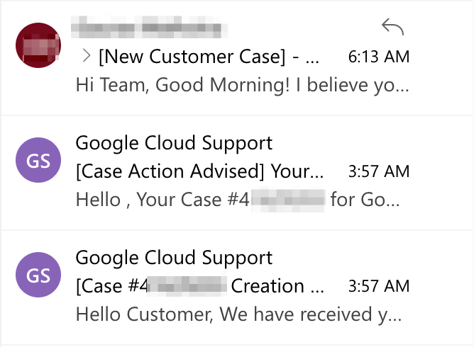
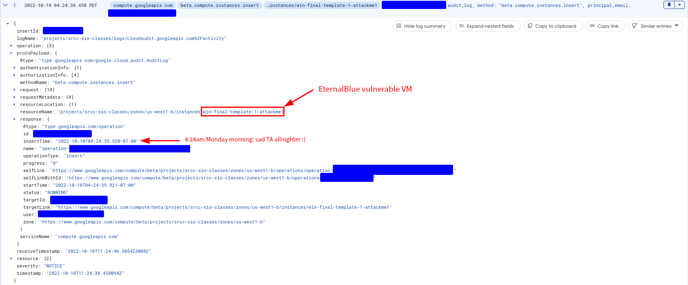
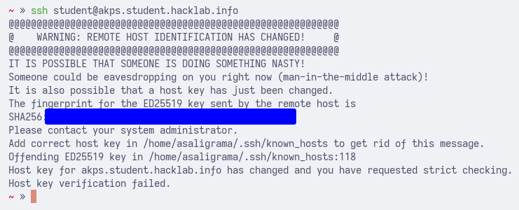
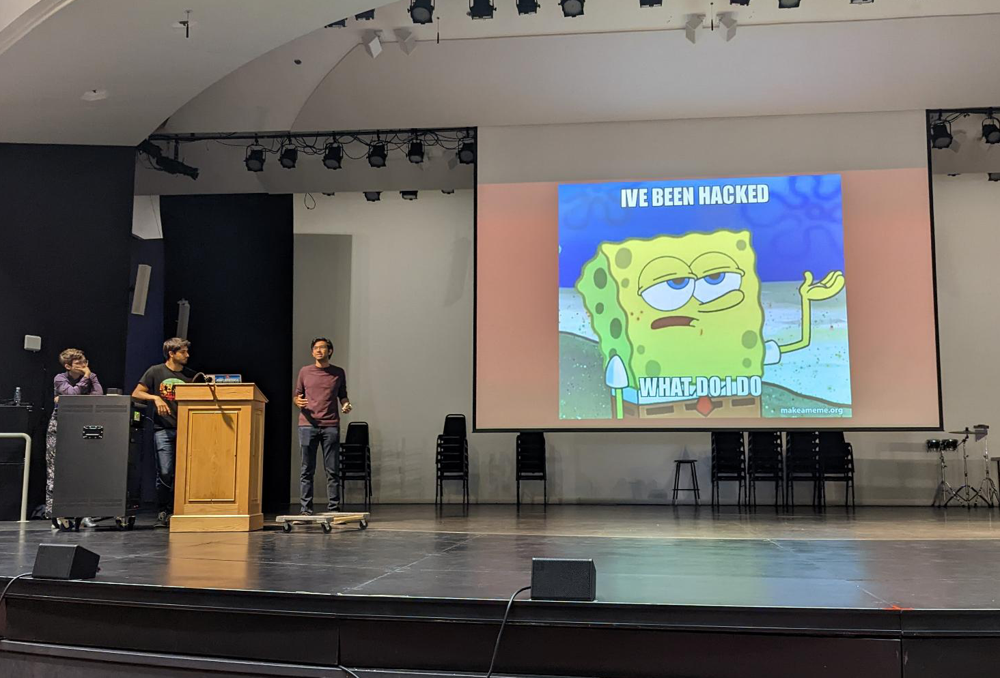

This morning, an [EternalBlue](https://en.wikipedia.org/wiki/EternalBlue)-vulnerable machine used for testing for Stanford's [Hack Lab](https://archive.ph/PfEXU) course accidentally given a public IP address on Google Cloud was unsurprisingly pwned and used to launch further EternalBlue scanning against other public web hosts.

This blog post describes our course's infrastructure setup (including why we had that testing box in the first place), how we discovered and remediated the incident, and how we used the incident as a way to teach students about incident response and public disclosure.

<!--more-->

# Hack Lab's Google Cloud infrastructure

Hack Lab is Stanford's introduction to cybersecurity, cyberlaw, and cyber policy class, with nearly 180 students enrolled. This fall, I'm one of five TAs for the class, and I had the responsibility of building much of our course infrastructure on [Google Cloud (GCP)'s Compute Engine](https://cloud.google.com/compute) before the quarter started.

Why GCP? We need to provide students with tools for learning about cyber topics during lab sections such as Burp Suite, Wireshark, `nmap`, and others. Previously, we used to give each student a Kali Linux virtual machine (VM) download preprovisioned with these tools. However, as more and more students use M1 Macs that don't support standard x86-64 virtualization, this solution started to become difficult to maintain.

This year, we decided to move those Kali VMs to the cloud to simplify our setup. Students can either use remote desktop or SSH to access the machines and use the security tools we've set up for them. Each machine has a public IP address attached, as well as a hostname via GCP's DNS support set up for easier access.

## Setting up an EternalBlue lab

This week's lab concerns buffer overflows and corporate intrusion, where students learn to use [Metasploit](https://www.metasploit.com/) to break into an EternalBlue-vulnerable Windows host. Each student gets their own vulnerable Windows Server 2008 virtual machine on a private subnet, which they learn how to gain administrator access on and find flags on the system that they use to pass the lab.

Setting up this lab was nontrivial, as our first worry was GCP's tendency to [automatically patch](https://cloud.google.com/compute/docs/os-patch-management) Windows and Linux hosts running vulnerable software. We thought this would be an issue for the lab. As it turns out, however, autopatching only happens when the machines are accessible to the public internet and have GCP's VM manager agent installed, neither of which applied to our machines.

The real issue, in fact, was configuring our own GCP networks and firewalls to allow the necessary network accesses for EternalBlue break-ins. This required creating the  Windows subnet on the right GCP region and zone, locking down the Windows machines to only have private IPs, and opening the right ports on the Windows machines to expose SMB and on the Kali machines to enable the use of [reverse shell listeners](https://www.offensive-security.com/metasploit-unleashed/about-meterpreter/). 

Figuring these cloud nuances out took us much of the night of Sunday, October 9 into Monday, October 10, as well as much of Monday itself. Eventually we were able to get everything to work and published the lab on 1:30am Tuesday morning, before students had to start working on them at 8:30am. Luckily, students didn't seem to have major issues completing the lab that day.

# Hack Lab gets hacked

## Notification of a possible pwn

This morning, I woke up to three emails from GCP sent between the hours of 4:00am and 6:00am that notified us that our course infrastructure was used to conduct port scans against nearly 230,000 IP addresses for EternalBlue vulnerability.

 

In my sleep-addled state when I got up, my first thought was "this doesn't look super legit to me, as when Google wants to tell you that your security sucks, usually it's a robot sending an email and not a human." But then I was able to verify the identity of the sender and the legitimacy of the email -- at which point I thought "we're running a hacking class where we're telling students to EternalBlue their way into machines, of course there's gonna be suspicious-looking traffic on the network."

At that point I read the sentence that warned us about a machine being used to scan nearly 230,000 IP addresses between 12:40am and 2:50am, and it finally dawned on me that this couldn't possibly be a student and that something was up here.

## A hurried incident response

By now, it was nearly 9am and students would start using the machines again during the first lab section of the day at 10:30am. I called our head TA [Cooper de Nicola](https://github.com/cdenicola) so we could figure out what was going on, accidentally waking him after a few nights of less-than-satisfactory sleep (sorry Cooper :/). 

We quickly determined that the IP address we were emailed about was a test machine we created at 4:24am on Monday morning with the name `win-final-template-1-attackme1`. In our sleep-addled state that day, we had accidentally given an EternalBlue-vulnerable machine a public IP address, exposing it to the web and the dangers (i.e., automated scanners) that lurk in the wild. 

 

Our first course of action was to immediately shut down and destroy that VM instance, as well as a few other similar test machines that had similar issues. Given our time constraints, we decided we wouldn't be able to do a thorough investigation of what the attacker was trying to do with our pwned box.

Our best theory is that we were simply targeted by an automated web scanner that detected our EternalBlue vulnerability, broke into the machine, and then started using that machine to repeatedly scan web hosts on the public internet for EternalBlue vulnerabilties (given the targeting of port 445 in particular). However, it's entirely possible that the attacker also installed malware or a cryptominer on the machine. 

It's extremely rare that attackers can break out of a GCP virtual machine to gain access to the broader GCP project, so we felt relatively safe that the project itself hadn't been maliciously accessed. However, we couldn't rule out the possibility that the student Windows or Kali machines had been broken into as well, so we decided to simply burn those VM instances down and rebuild it from scratch.

Thanks to the robust and maintainable infrastructure management code we built out before the quarter started, we were able to do this in only 15 minutes while only using 7 command-line commands and have everything ready well before the lab started at 10:30am. The only remaining issue was that some students received scary messages warning of an SSH man-in-the-middle attack as the VM fingerprint had changed on regeneration. We had to provide instructions so that students weren't encumbered by this in the course of completing the lab.

 

## Turning the hack into a teachable moment

Conveniently, this week at Hack Lab is when we teach about corporate intrusion, security research, and responsible disclosure in lecture. We decided we could use our own incident as a way of doing a public postmortem to our students and illustrating how to responsibly handle incidents like these. So Cooper and I got up on the stage of Dinkelspiel Auditorium and ate the humble pie.

 

In particular, we talked about how the breach happened, the (nonexistent) impact on students and their data, and how enterprises have an ethical obligation to inform their stakeholders about breaches once incidents are remediated. We feel that leading by example in this context is highly important given the less-than-stellar reputation of Stanford student startups with regards to properly handling vulnerability disclosures and other security incidents.

# Conclusion

This incident yields a couple of lessons for ourselves in the future here: always audit what infrastructure we have exposed to the public, and be extra careful running deliberately vulnerable services! In general, this hack demonstrates that breaches can happen to anyone, including the instructors of a cybersecurity class. As such, how one responds to a breach is as or more important than keeping things secure in the first place, and I'm pretty proud of our response here.