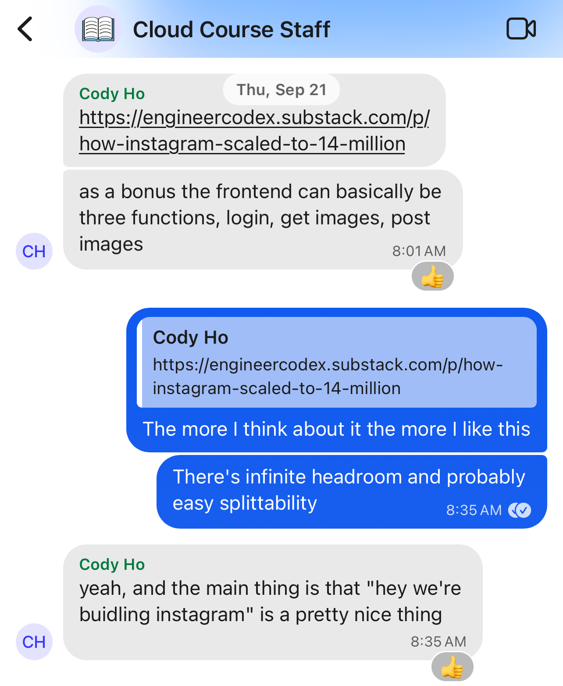

*This is the first post in a three-part retrospective on teaching CS 40.*

Last quarter (Winter 2024), [Cody Ho](https://github.com/aesrentai) and I taught [CS 40](https://infracourse.cloud) *Cloud Infrastructure and Scalable Application Deployment* at Stanford, a new course we'd been working on creating for nearly a year. CS 40 is Stanford's first-ever hands-on intro cloud computing course, and with 50 students enrolled, achieving our instructional goals of leaving students with a robust understanding of the material was no easy feat.

Wrapping up the quarter, I'm thrilled with how the course turned out, even given how hectic it was at times. This post is a retrospective on the process of designing the course, getting it approved, and building out course content before the start of the quarter.

<!--more-->

# Course motivation

The idea to teach a course about cloud infrastructure first came to me in Spring 2023 arising from my work with the Stanford entrepreneurial community over the last few years. Stanford startups, particularly those in the consumer social space, have historically had a [poor](https://stanforddaily.com/2019/11/19/queer-chart-startup-exposes-student-data/) track [record](https://stanforddaily.com/2020/08/13/vulnerability-in-link-website-may-have-exposed-data-on-stanford-students-crushes/) with [security](https://stanforddaily.com/2022/11/01/opinion-fizz-previously-compromised-its-users-privacy-it-may-do-so-again/). Since 2021, I've disclosed critical security vulnerabilities to over 20 startups marketing at Stanford, and have helped numerous more through the [Stanford Security Clinic](https://securityclinic.org).

More than just finding vulnerabilties, however, this process also gave me a window into the infrastructure deployment topology of many of these startups. The mode tech stack was far and away React single-page applications and React Native mobile apps that were thin clients over a Firebase backend-as-a-service -- a [foot cannon](/blog/post/firebase-insecure-by-default) that makes achieving security with common data models difficult, but it also ties the app's entire functionality and logic to that specific BaaS provider. When Firebase no longer makes sense for an app -- often for cost, security, or data modeling reasons -- migrating to a more industry-standard architecture can be an ordeal.

And beyond Firebase, we'd also seen many suboptimal infrastructure and architecture configurations -- for example, the use of hosted GraphQL providers when that transport protocol made no sense for the given application, or PHP/Laravel stacks with MySQL on the same compute instance.

Given our prior experience -- beyond security and infrastructure-focused internships at cloud-native tech companies, I led infrastructure for a [Stanford course](/blog/post/hack-lab-got-hacked) and a [startup](https://medeloop.ai), and Cody has been instrumental in building up the [Applied Cyber](https://applied-cyber.stanford.edu) competition test range -- we came up with the idea to teach a course focusing on architecting robust application deployments on the public cloud. We hoped such a course could inform students about the cloud resources available in deploying applications, and to be able to use those resources using best-practice architectures and techniques.

Beyond startups, we reasoned that such skills would be useful to any technical career. Nearly every tech company today uses the public cloud in some way; any Stanford graduate entering the software engineering workforce will reasonably be expected to work with the cloud. The public cloud features heavily in academic computer science research as acquiring compute resources isn't subject to hardware lead times.

Despite the importance of these skills to a modern education in computer science, to our knowledge no university has offered a hands-on intro cloud computing course to its undergraduates. A number of continuing education programs *do* offer cloud-focused courses, but they tend to be survey courses without programming assignments that are targeted at mid-career professionals, particularly those transitioning from on-prem systems administration to cloud DevOps.

Anyone else -- and especially a "typical" CS graduate going into software engineering -- is expected to learn about cloud deployment techniques either from a sympathetic senior engineer at an internship or a job, or on their own. Unfortunately, with how complicated modern public cloud platforms have become, self-learning these skills can be difficult.

Given this context, we recognized the need for a course that teaches basic cloud fluency. In focusing on teaching cloud deployment skills in a hands-on way to students with existing software development background, we knew we would be doing something completely new -- but we felt up to the challenge.

# Prototyping the initial course structure

We knew that teaching a student course was something realistically achievable as Stanford CS coterm (BS + MS) students. After all, at the time, our friend [Akshay Srivatsan](https://aks.io) was in the middle of teaching [CS 45](https://cs45.stanford.edu) *Software Tools Every Programmer Should Know*, an introductory course on development environments and essential tools.

In our initial exploration of the idea, our first step was to chat with [Mike Abbott](https://www.linkedin.com/in/michaelabbott), who was at the time leading the Cloud Services organization at Apple as a VP of Engineering. Mike had taught [CS 153](https://cs153.stanford.edu) *Applied Security at Scale*, which Cody and I had both taken the previous quarter. I approached Mike about the idea in late May 2023 as he was distributing a late shipment of course T-shirts. Mike loved our idea, and he told us he could advise us for the class and help coordinate guest speakers and cloud credits for students. We were off to the races.

Throughout the summer, Cody and I worked on writing a course syllabus and proposal that we could take to the CS department to get the course approved. Akshay helped us out tremendously here, sending us all of the material and documentation for CS 45's approval process. This gave us a basic idea of what the department would expect from us and what the process would look like.

We oriented our syllabus around four main learning goals:

> #### Course Goals
> 1. Understanding the types of cloud resources made available by cloud providers that help in deploying applications.
> 2. Architecting a cloud deployment by selecting resources for optimal scaling (performance) and cost efficiency.
> 3. Systematically deploying cloud resources using Infrastructure as Code (IaC).
> 4. Ensuring your deployment remains secure, observable, and continuously updated.

In practice, fulfilling the first goal meant planning out a set of lectures that covered the core areas of cloud application deployment. Roughly in order, these included the basics of (and further detail in) compute, networking, and storage resources; security and observability; cloud AI/ML pipelines; and CI/CD.

Meanwhile, the remaining goals would be fulfilled through a set of hands-on assignments that would teach students to deploy web applications to the cloud using infrastructure as code.

Originally, we envisioned giving students a base application that they could deploy different aspects of, extending their deployment in each of the 10 weeks of the course -- starting by using "ClickOps" (i.e., the web console), and then replacing that initial setup with a more robust IaC-based configuration. However, we later realized that this level of granularity would be difficult to manage for both us and the students, and we wound up consolidating everything into four assignments, three of which were IaC-based.

We also added a final project where students could demonstrate their understanding of the course material through the deployment of any application of their choice.

# The course approval process

Once we had our initial syllabus, we first shopped it with some friends for feedback -- shoutout to [Nathan Bhak](https://github.com/nbhak), [Glen Husman](https://github.com/glen3b), [Miles McCain](https://miles.land), and [Akshay Srivatsan](https://aks.io) for suggestions on lecture and assignment content, as well as course policy. [Ben Tripp](https://www.linkedin.com/in/benjamin-tripp/) also agreed to be our teaching assistant, and he was instrumental in making this course succeed.

We then hopped on a call with Mike in late August to get his thoughts. Beyond feedback on the syllabus itself, Mike was able to point out a few key places where some industry veterans in the cloud space that he knew well could drive our course content forward as guest speakers. Mike made a number of such introductions for us, and he also got us in contact with [Christos Kozyrakis](https://web.stanford.edu/~kozyraki/), a professor in electrical engineering and computer science with research interests in cloud computing, who would serve as our faculty sponsor.

With some final feedback from Christos, in late September we followed Akshay's lead and emailed our proposal to [Chris Gregg](https://stanford.edu/~cgregg), the CS department's Associate Chair for Education. Chris interfaced with the department's Curriculum Committee on our behalf, and helped us overcome the potential roadblock of the committee only accepting new course suggestions in the spring for the following year.

The committee only had some minor feedback for us, and by mid-October, we had our final approval to offer the course -- now numbered CS 40 -- in the winter, provided that both of us switch to graduate tuition status per department policy.

Winter quarter enrollment day was Wednesday, November 29, and this would be the moment of truth in terms of student interest in CS 40. We'd done a decent bit of marketing over the last few weeks, blasting a flyer out to any CS-adjacent mailing list and to a number of clubs, as well as promoting the course on social media. 

With our initial course cap of 50 students, we were able to fill the course up from just the first seven enrollment groups (i.e., before any sophomores or freshmen were able to register based on priority). After negotiating for a larger room and increasing our course cap, we had enrolled 60 students with 21 on the waitlist at our peak.

# Building out the course

By the time we had our course approval in hand, we were already hard at work building out some of the technical aspects of the course. For me, this involved creating the backend for [Yoctogram](https://github.com/infracourse/yoctogram-app), a minimal image-sharing web application that would be used by students as the primary deployable for assignments. 

Our decision to build an image-sharing app was based on a [blog post](https://read.engineerscodex.com/p/how-instagram-scaled-to-14-million) detailing Instagram's early architecture. We felt that the domain allowed us to make the app as simple or as complex as needed based on the needs of the course, and that modernizing some of the infrastructure choices would lead to an architecture that would be suitable for many early-stage startups like the ones we see at Stanford.

Fall quarter consisted of a lot of heads-down building of Yoctogram's backend and deployment IaC, which would serve as the starter code for Assignment 2 and a base for Assignments 3 and 4. We also built a [course website](https://infracourse.cloud) and some miscellaneous course management infrastructure. I'll talk more about their technical specifics in a later post.

Lastly, we started working on lecture slides for the early parts of the course in late December. By the time winter quarter started, we had mostly been able to pre-prepare all the material for the first few weeks of the course.

*To be continued: building CS 40 course infrastructure.*