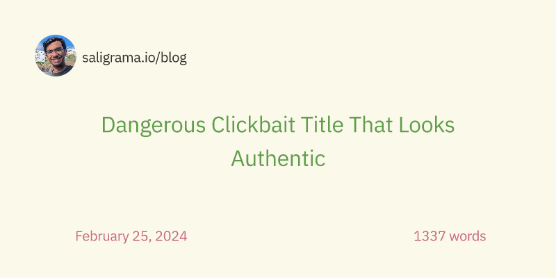
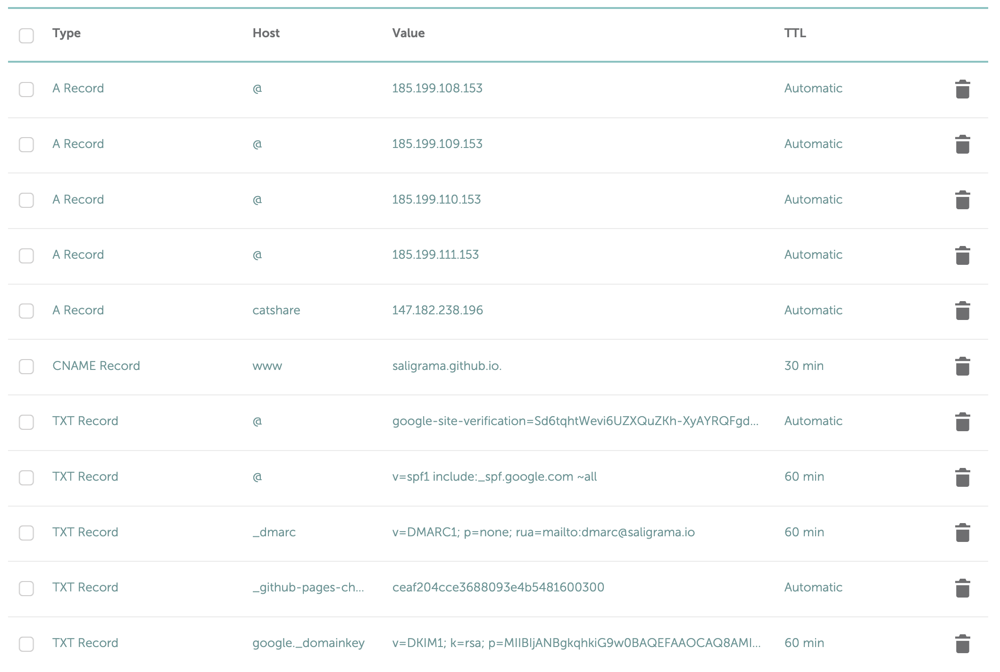
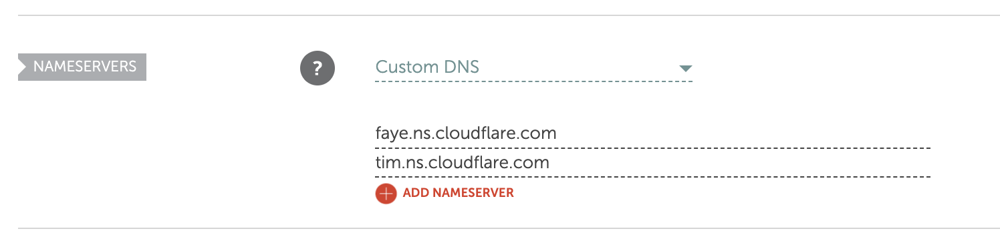
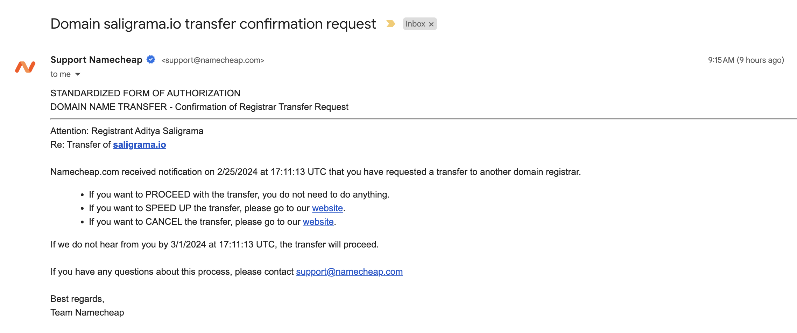
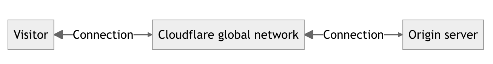

I acquired my personal domain `saligrama.io` in August 2018, and since then, I've used a number of different providers to manage its DNS records as well as the hosting infrastructure hanging off of it.

Recently, I decided to migrate as much of this infrastructure as I could to Cloudflare. This post describes the migration process that enabled me to move everything over smoothly without any downtime, all while using Terraform to systematize the resources with infrastructure-as-code.

<!--more-->

# The Existing Infra State

I initially registered the `saligrama.io` domain from Namecheap in August 2018 under the [student discount program](https://nc.me) that allowed me to pay only $30 for the first year for a bundle including that and a `.me` domain. 

Between 2018 and 2022, I created a number of static Hugo sites all hosted on GitHub Pages:
* `saligrama.io`: main/about page
* `saligrama.io/blog`: this blog
* `saligrama.io/photo`: a photography portfolio
* `saligrama.io/notes`: notes taken from Stanford CS classes

My main email account also hangs off the `saligrama.io` domain on a [Google Workspace Business Standard](https://workspace.google.com/pricing.html) plan.

Over the years, I've also used the domain as a convenient way to link to other resources, such as some initial test resources for [CS 40](https://infracourse.cloud). Currently, the only such active resource is [CatShare](https://catshare.saligrama.io), a deliberately vulnerable website I use for security demos at Stanford. This had been hosted on a Digital Ocean droplet using Nginx and `docker-compose`.

Another bit of infra that I had was a service that would generate [OpenGraph](https://ogp.me/) images for this blog dynamically given a title, a date, and a word count. This was hosted on Vercel using their OpenGraph image generation [library](https://vercel.com/docs/functions/og-image-generation), and was a little insecure given that anyone could make a request to that service and make it appear that I had arbitrary, possibly unhinged blog post titles.



# Motivation

Compared to more modern solutions, GitHub Pages is fairly limited.

* You're generally forced into specific patterns of naming and hosting repositories.
    - The main site needs to be named `account.github.io`
    - Adding extra sites (e.g. `blog`) ends up under `example.com/blog` without any native subdomain support.
* Deploying Hugo sites requires adding a GitHub Actions workflow to build the static site into a separate branch.
* There's no native analytics functionality.
* There's no ability to run minimal serverless functions if I later on want to add extra functionality that needs it.

[Cloudflare Pages](https://pages.cloudflare.com/) gives me a lot more flexibility for the above. I've been successfully using it to host some of the infrastructure for CS 40, including the main course website and resource provisioner.

Cloudflare Pages hosting also supports some nice bleeding-edge features, including HTTP/3 support.

Moreover, given my Namecheap domain discount expired several years ago, I wasn't saving any money by continuing to register `saligrama.io` there. Moving the domain registration and records would unlock some extra functionality Cloudflare offers, even if I didn't have any current uses for it.

Moving to Cloudflare also gave me the opportunity to deploy everything using Terraform for infrastructure-as-code, which would let me more systematically manage the state of the infrastructure.

# Migrating to Cloudflare

The migration process roughly went as follows:

1. Set up the Terraform provider and backend
2. Mirror GitHub Pages sites to Cloudflare Pages
3. Provision orphan DNS zone and mirror records from Namecheap
4. Activate Cloudflare zone as authoritative
5. Move domain registration to Cloudflare
6. Switch apex domain record to Cloudflare Pages
7. Deactivate GitHub Pages records

Essentially, I set up the Cloudflare infrastructure in parallel to the existing Namecheap and GitHub infrastructure, only activating the former when fully set up in order to avoid downtime.

## Setting up Terraform

This is a simple matter of creating a [new repository](https://github.com/saligrama/saligrama-io-tf) for the Terraform configuration to live and initializing the Cloudflare Terraform provider.

I decided to use [Spacelift](https://spacelift.io/) to manage my Terraform state, given concerns about storing the state locally and the fact that Spacelift is free for up to two users. To set this up, I registered for Spacelift using my GitHub account as an identity provider, and run through their [stack creation guide](https://docs.spacelift.io/concepts/stack/creating-a-stack) connecting the `saligrama-io-tf` repository. From there, Spacelift does a `terraform plan` and `terraform apply` on each commit I push to the repository.

At this point, the Terraform configuration was in a fairly bare state, doing the bare minimum to initialize the Cloudflare provider.

```hcl
// saligrama-io-tf/main.tf

terraform {
  required_providers {
    cloudflare = {
      source  = "registry.terraform.io/cloudflare/cloudflare"
      version = "~> 4.0"
    }
  }
}

provider "cloudflare" {
  api_token = var.cloudflare_api_token
}
```

```hcl
// saligrama-io-tf/vars.tf

variable "cloudflare_api_token" {
  type      = string
  sensitive = true
}

variable "cloudflare_account_id" {
  type      = string
  sensitive = true
}
```

The `cloudflare_account_id` variable is obtainable from the Cloudflare dashboard, and we can generate the API token from the Cloudflare dashboard scoped to edit DNS records and Cloudflare Pages projects. These values should be saved as environment variables (i.e., `TF_VAR_cloudflare_api_token`, `TF_VAR_cloudflare_account_id`) in Spacelift.

## Redeploying GitHub Pages sites on Cloudflare Pages

Cloudflare Pages is natively supported with the Cloudflare Terraform provider and has a GitHub integration to automatically deploy changes pushed to GitHub, so we just need to write some configuration to set this up. Here's the configuration for the main `saligrama.io` site and this `blog` site, though the setup looks identical for the other two.

```hcl
// saligrama-io-tf/sites.tf

resource "cloudflare_pages_project" "saligrama" {
  account_id        = var.cloudflare_account_id
  name              = "saligrama"
  production_branch = "main"

  source {
    type = "github"
    config {
      owner                         = "saligrama"
      repo_name                     = "saligrama.github.io"
      production_branch             = "main"
      deployments_enabled           = true
      production_deployment_enabled = true
    }
  }

  build_config {
    build_command   = "hugo --gc --minify"
    destination_dir = "public"
    root_dir        = ""
  }
}

resource "cloudflare_pages_project" "saligrama-blog" {
  account_id        = var.cloudflare_account_id
  name              = "saligrama-blog"
  production_branch = "main"

  source {
    type = "github"
    config {
      owner                         = "saligrama"
      repo_name                     = "blog"
      production_branch             = "main"
      deployments_enabled           = true
      production_deployment_enabled = true
    }
  }

  build_config {
    build_command   = "hugo --gc --minify"
    destination_dir = "public"
    root_dir        = ""
  }
}
```

This deploys the main site to `saligrama.pages.dev` and the blog to `saligrama-blog.pages.dev`. I quickly checked that all the sites loaded, and everything worked other than some CSS resources for my photography site attempting to still load from `saligrama.io/photo` and encountering CORS errors as a result.

Given that each of the subsites are loaded as subpages rather than subdomains of `saligrama.io`, we still want to maintain this setup in order to not break any existing links; i.e., the blog should load from `saligrama.pages.dev/blog` rather than a separate domain. Unfortunately, Cloudflare doesn't offer this functionality natively.

Instead, we can use [ProxyFlare](https://proxyflare.works) in a [middleware function](https://developers.cloudflare.com/pages/functions/middleware/#adding-middleware) to make this work. This code proxies the `to` URL when any pattern on the `from` path is queried, including any subpaths.

```ts
// saligrama.github.io/functions/_middleware.ts

import proxyflare from "@flaregun-net/proxyflare-for-pages"

export const onRequest: PagesFunction[] = [
  (context) => proxyflare({
    config: {
      routes: [
        {
          from: { pattern: "saligrama.pages.dev/blog/*", },
          to: { url: "https://saligrama-blog.pages.dev/", },
        },
        {
          from: { pattern: "saligrama.pages.dev/notes/*", },
          to: { url: "https://saligrama-notes.pages.dev/", },
        },
        {
          from: { pattern: "saligrama.pages.dev/photo/*", },
          to: { url: "https://saligrama-photo.pages.dev/", },
        },
        {
          from: { pattern: "saligrama.io/blog/*", },
          to: { url: "https://saligrama-blog.pages.dev/", },
        },
        {
          from: { pattern: "saligrama.io/notes/*", },
          to: { url: "https://saligrama-notes.pages.dev/", },
        },
        {
          from: { pattern: "saligrama.io/photo/*", },
          to: { url: "https://saligrama-photo.pages.dev/", },
        },
      ]
    }
  })(context)
]
```

Note that at this point GitHub pages is still serving `saligrama.io`, since we haven't changed the DNS records to point to Cloudflare Pages.

## Provisioning DNS

The next step is to set up DNS mirroring the existing records on Namecheap. The existing state of the Namecheap DNS records was as follows:



This boiled down to

* `A` records for the root `saligrama.io` domain to GitHub Pages, and for `catshare` to my DigitalOcean droplet
* `TXT` records for email security (SPF, DKIM, and DMARC), as well as for verifying ownership of my domain for Google Workspace and GitHub Pages
* `MX` records (not shown) for pointing mail to Google Workspace's mail servers

This step consisted of dumping these DNS records into Terraform and then deploying them to Cloudflare.

The first bit is deploying an empty orphan zone for `saligrama.io` to Cloudflare. This zone doesn't become authoritative until we point the nameservers for the apex domain to Cloudflare in the Namecheap console.

```hcl
// dns.tf

resource "cloudflare_zone" "saligrama_io" {
  account_id = var.cloudflare_account_id
  zone       = "saligrama.io"
}
```

After applying this configuration, we can then go ahead and start adding the records into Terraform.

```hcl
// dns.tf

resource "cloudflare_record" "root_saligrama_io_gh_pages_108" {
  zone_id = cloudflare_zone.saligrama_io.id
  type    = "A"
  name    = "@"
  value   = "185.199.108.153"
}

// more GitHub pages A records

resource "cloudflare_record" "catshare_saligrama_io" {
  zone_id = cloudflare_zone.saligrama_io.id
  type    = "A"
  name    = "catshare"
  value   = "147.182.238.196"
}

resource "cloudflare_record" "root_saligrama_io_spf" {
  zone_id = cloudflare_zone.saligrama_io.id
  type    = "TXT"
  name    = "@"
  value   = "v=spf1 include:_spf.google.com ~all"
}

// more TXT records

resource "cloudflare_record" "mx_aspmx_google_saligrama_io" {
  zone_id  = cloudflare_zone.saligrama_io.id
  name     = "@"
  value    = "aspmx.l.google.com"
  type     = "MX"
  priority = 1
}

// more MX records
```

After applying this, the DNS records list on the Cloudflare dashboard for the `saligrama.io` zone looks exactly like the one on Namecheap.

## Setting the Cloudflare zone as authoritative

This is a simple ClickOps step. Cloudflare gives us the nameservers that we should plug in on the Namecheap console. In my case, these were `faye.ns.cloudflare.com` and `tim.ns.cloudflare.com`.

Here, we just change the "Nameservers" setting on the "Domain" tab in Namecheap to "Custom DNS", providing the Cloudflare nameservers.



This took about ten minutes to activate, and Cloudflare helpfully emailed me to let me know that my zone was now active and authoritative. I continued unceremoniously receiving spam over the next few hours, which let me know my mail records hadn't broken.

## Moving domain registration to Cloudflare

This is another ClickOps step in the Namecheap console. Under the "Sharing and Transfer" tab, we turn "Domain Lock" off, which sends us an email with an [Auth-Code](https://en.wikipedia.org/wiki/Auth-Code).


It then takes the unlock status a few hours to propagate, and in the morning when Cloudflare recognized the new status, I could then enter the auth code in that console. 

Interestingly, when transferring a domain to a different registrar, the new registrar renews the registration for another year. Here, Cloudflare essentially pre-charged me for my yearly August renewal; the fee was about $45.

After paying the fee, it appeared that it would take several days for the domain transfer to process. However, Namecheap sent me another email where I could opt in to expedite the transfer project, and after clicking on that confirmation the transfer process completed instantaneously.



## Switching the apex DNS records to Cloudflare Pages

At this point Cloudflare was both my authoritative zone nameserver and my domain registrar, but the apex `saligrama.io` record was still pointing to GitHub pages. To serve `saligrama.io` from Cloudflare pages required changing some more DNS records in Cloudflare.

First, we add custom domain support to the root Cloudflare Pages project:

```hcl
// sites.tf

resource "cloudflare_pages_domain" "saligrama" {
  account_id   = var.cloudflare_account_id
  project_name = cloudflare_pages_project.saligrama.name
  domain       = "saligrama.io"
}
```

Next, we switch the `A` records pointing `@` (the apex) to GitHub pages to `CNAME` [proxied records](https://developers.cloudflare.com/dns/manage-dns-records/reference/proxied-dns-records/) pointing to Cloudflare Pages.

```hcl
// dns.tf

resource "cloudflare_record" "root_saligrama_io_cf_pages" {
  zone_id = cloudflare_zone.saligrama_io.id
  type    = "CNAME"
  name    = "@"
  value   = cloudflare_pages_project.saligrama.subdomain
  proxied = true
}
```

This essentially lets us point `saligrama.io` to `saligrama.pages.dev`, but with Cloudflare doing the work of fronting the content from `saligrama.pages.dev` without redirecting us there.



Since we already have Proxyflare set up for the subsites, there's no additional work to be done on that end.

Applying the Terraform configuration successfully switches the records to point to Cloudflare Pages.

## Tearing down GitHub Pages resources

For every GitHub pages site, I simply clicked "Unpublish" under Settings > Pages, and then pushed a commit removing the GitHub actions build and publish workflow.

I also removed the GitHub site verification record from Terraform, applying that configuration.

# More Technically Involved Migrations

## OpenGraph image generator

As it turns out, one extra plugin that Cloudflare Pages supports is an [OpenGraph image generator](https://developers.cloudflare.com/pages/functions/plugins/vercel-og/) that conveniently is also backed by the same Vercel library I was using. Thus, I could port my service over by attaching it as a [middleware function](https://github.com/saligrama/blog/blob/main/functions/_middleware.tsx) within the blog Pages deployment.

This function uses Cloudflare's HTML extraction functionality to extract the title, date, and word count from any Hugo page it serves. It then renders a React component into an image using the Vercel library (exactly what my previous service was doing) and attaches that with another HTML tag.

The main advantage here was that the renderer only activates on existing blog posts (and not arbitrary content), and that we can better take advantage of Cloudflare's caching of the overall website content along with the OpenGraph image.

The primary technical difficulty here ended up being making the renderer access the IBM Plex Sans font. This required me to use Adobe Fonts to download the font file, and wrap the rendering `PagesFunction` in another `PagesFunction` so I could actually unwrap the `fetch` `Promise` when retrieving the font.

## CatShare

By virtue of being hosted on a Digital Ocean droplet, CatShare was costing me $7/mo, or $84/yr. CatShare, as originally written, was a NodeJS service using Express, but the backend was "thin" in that there was no database dependency and it was mainly rendering static pages.

I'd already dockerized the service back in October, and so the easiest migration would have been to host the Docker image on a container hosting platform like Fly.io. However, Fly.io's cheapest "Hobby" plan is $5/mo, which didn't offer much in the way of cost savings.

Instead, I ended up refactoring CatShare into yet another Cloudflare Pages Functions [project](https://github.com/saligrama/catshare-serverless). I couldn't straightforwardly port the existing NodeJS/Express app, since the Cloudflare Workers/Functions runtime's [support](https://developers.cloudflare.com/workers/runtime-apis/nodejs/) for NodeJS APIs is still a work in progress. But since the original app was already in JS, rewriting it into a Cloudflare Function only took an afternoon, and adding TypeScript helped make it more robust.

I also added a [Cloudflare D1](https://developers.cloudflare.com/d1/) serverless SQL database to store some of the data I had previously been keeping in static JS files. While I haven't added any new functionality using D1 yet, this does give me the opportunity to add SQL injection as a "feature" for workshop use. I might add support for this later on if I can figure out how to ensure that the database remains read-only even when SQL syntax is injected into queries.

Deploying CatShare as a Pages Function was another straightforward Terraform declaration to create the project, the D1 database, the domain name, and the DNS record.

```hcl
// sites.tf

resource "cloudflare_pages_project" "catshare" {
  account_id        = var.cloudflare_account_id
  name              = "catshare"
  production_branch = "main"

  source {
    type = "github"
    config {
      owner                         = "saligrama"
      repo_name                     = "catshare-serverless"
      production_branch             = "main"
      deployments_enabled           = true
      production_deployment_enabled = true
    }
  }

  deployment_configs {
    production {
      d1_databases = {
        USERS_DB = cloudflare_d1_database.catshare_db.id
      }
    }
  }
}

resource "cloudflare_d1_database" "catshare_db" {
  account_id = var.cloudflare_account_id
  name       = "catshare"
}

resource "cloudflare_pages_domain" "catshare" {
  account_id   = var.cloudflare_account_id
  project_name = cloudflare_pages_project.catshare.name
  domain       = "catshare.saligrama.io"
}
```

```hcl
// dns.tf

resource "cloudflare_record" "catshare_saligrama_io_cf_pages" {
  zone_id = cloudflare_zone.saligrama_io.id
  type    = "CNAME"
  name    = "catshare"
  value   = cloudflare_pages_project.catshare.subdomain
  proxied = true
}
```

## sad.singles

[sad.singles](https://sad.singles) is a toy project. I'm intentionally going to avoid explaining what it does, because you should totally click the link :)

The project was initially hosted by [Glen Husman](https://github.com/glen3b), who had purchased the domain name from Namecheap last year and set up a simple Python script running on Google App Engine to do the IP-based redirect behavior. When he ran out of Google Cloud credits, the project was transitioned to a singular static redirect configured on the Namecheap end. 

During the course of my other migrations, I realized I could rehost the project for free using (you guessed it) a Cloudflare Pages Function. Rewriting the Python script in Typescript was quick, and I also added a fun easter egg where you can set your `X-Forwarded-For` header to experience the behavior from an IP address of your choosing.

> Aside: the header that conveys the user IP to the function (`CF-Connecting-IP`) can't be spoofed; when you try to do this, Cloudflare will instantly return you a 403 forbidden error. I decided to name the header `X-Forwarded-For` as a homage to a spoofing attack on a [vulnerability](https://github.com/robromano/django-adminrestrict/issues/21) in `django-adminrestrict` that I conducted during a [Stanford Security Clinic](https://securityclinic.org) engagement.

Deploying this followed the same process as some of my other website infrastructure. I set up the hosted zone, had Glen point the nameservers on the Namecheap end to the Cloudflare nameservers, and then deployed the Pages project and domain name, all using Terraform.

```hcl
// dns.tf

resource "cloudflare_zone" "root_sad_singles" {
  account_id = var.cloudflare_account_id
  zone       = "sad.singles"
}

resource "cloudflare_record" "root_sad_singles" {
  zone_id = cloudflare_zone.root_sad_singles.id
  name    = "@"
  value   = cloudflare_pages_project.sadsingles.subdomain
  type    = "CNAME"
  proxied = true
}
```

```hcl
// sites.tf

resource "cloudflare_pages_project" "sadsingles" {
  account_id        = var.cloudflare_account_id
  name              = "sadsingles"
  production_branch = "main"

  source {
    type = "github"
    config {
      owner                         = "saligrama"
      repo_name                     = "sadsingles"
      production_branch             = "main"
      deployments_enabled           = true
      production_deployment_enabled = true
    }
  }
}

resource "cloudflare_pages_domain" "sadsingles" {
  account_id   = var.cloudflare_account_id
  project_name = cloudflare_pages_project.sadsingles.name
  domain       = "sad.singles"
}
```

Since the domain expiry date was coming up in the next few days, Glen also transferred me the domain registration, and this is also registered with Cloudflare now.

# Reflections

This ended up being a fairly seamless migration. The key insight is that the recursive nature of DNS lends itself nicely to mirroring configurations over to Cloudflare and only executing the authoritative switchover step when everything looked good. This was done twice: with the zone authoritative nameservers and with the GitHub Pages to Cloudflare Pages migration.

The main limitation I experienced was that Cloudflare doesn't natively support mounting a Pages project as a subdirectory of another, though Proxyflare works nicely here.

I'm tentatively happy with how this is all running now, and it'll be interesting to see what more benefits I can get out of centralizing on Cloudflare infrastructure in the near future.
